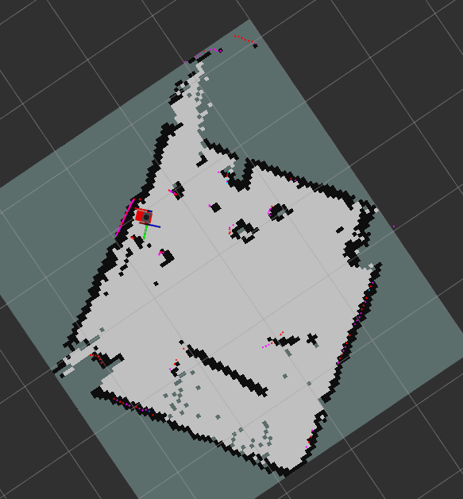
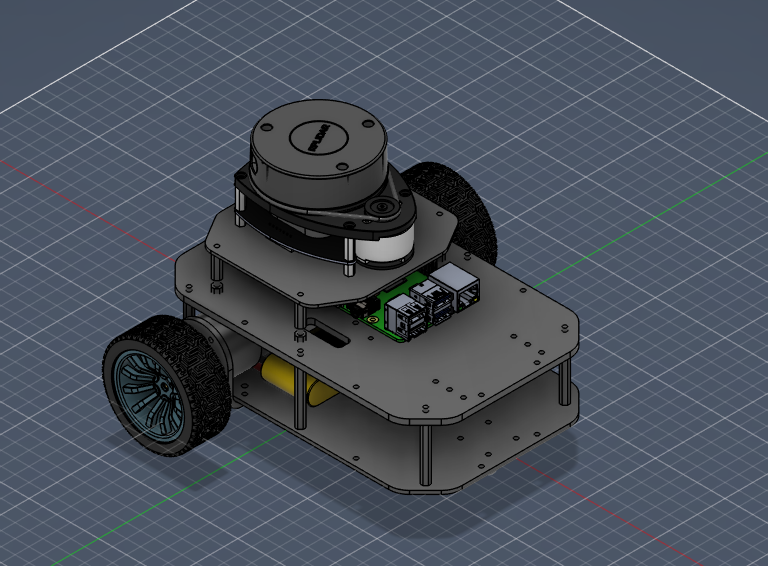
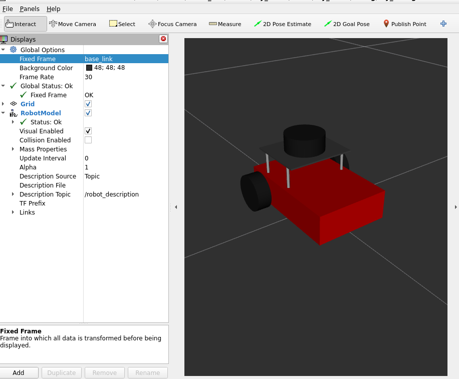
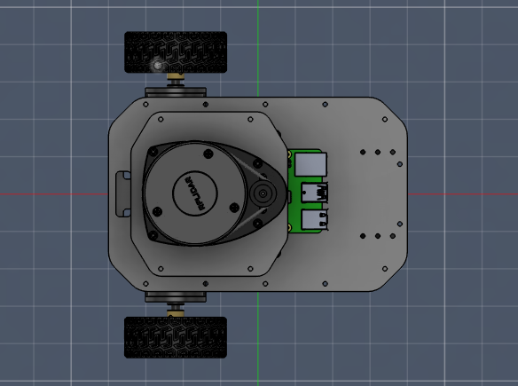
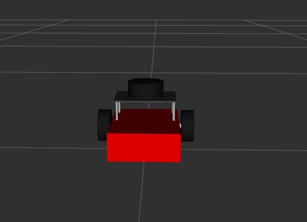
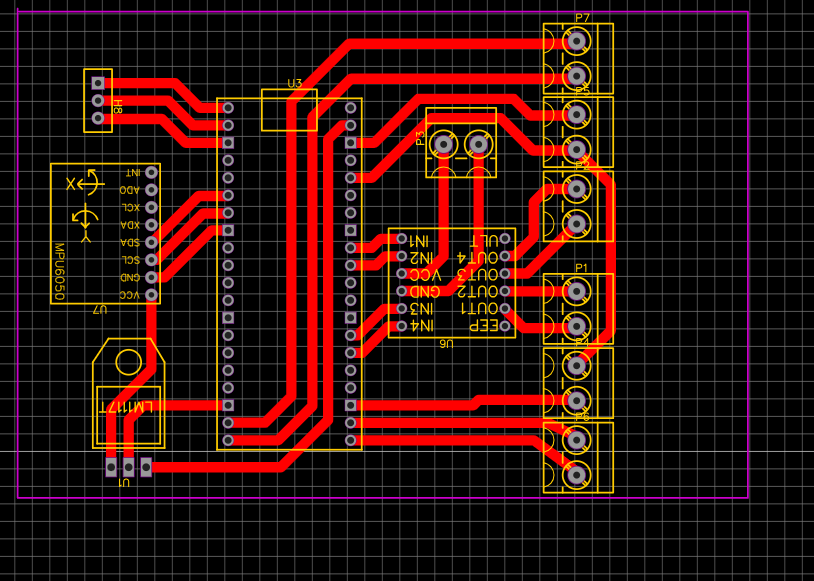
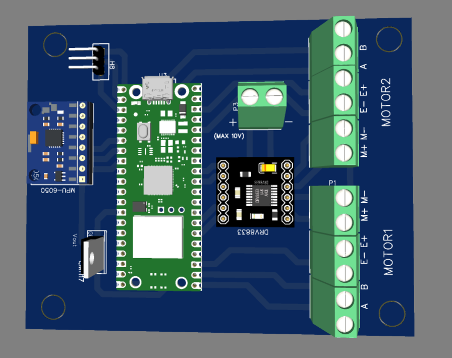

# differential_robot_ros2
Robot autónomo ROS2 Humble, SLAM + Nav2 

[](#)
[](#)
[](#)
[](#)
[](#)
[](#)
[](#)
[](#)
[](#)
<!-- [](#) -->
<!-- [](#) -->
[](#)
[](LICENSE)
[](#)


# Proyecto de Robot Móvil con RPLIDAR y ROS2

Este repositorio documenta el desarrollo completo de un **robot móvil diferencial** basado en **ROS 2 Humble**, equipado con un **RPLIDAR A1**. Incluye la integración de hardware, configuración de drivers, pruebas en RViz2 y todo el proceso de puesta en marcha.

---

## 📌 1. Descripción general del proyecto

El proyecto consiste en la implementación de un robot móvil que utiliza:

* Raspberry Pi 4
* RPLIDAR A1
* Motores DC con encoder
* ROS2 Humble + SLAM Toolbox + Nav2
* Nodo personalizado para movimiento
* Configuración completa de sensores

El objetivo es lograr navegación básica, lectura de LIDAR, visualización en RViz2, y pruebas iniciales de SLAM.

---

## 📦 2. Estructura del repositorio

```
├── launch/                 # Archivos .launch.py
├── config/                 # Archivos YAML de parámetros
├── src/                    # Nodos personalizados
├── urdf/                   # Modelos del robot
├── README.md               # Este documento
└── package.xml / CMakeLists.txt
```

---

## 🌟 Características Principales

<div align="center">

| Feature | Descripción |
|---------|-------------|
| 🗺️ **SLAM en Tiempo Real** | Mapeo simultáneo y localización con SLAM Toolbox asíncrono |
| 🎯 **Navegación Autónoma** | Sistema Nav2 completo con planificación global (NavFn) y local (DWB) |
| 🎮 **Control Teleoperable** | Soporte para Xbox controller y teleop_twist_keyboard durante mapeo |
| 📊 **Visualización Completa** | RViz2 con costmaps dinámicos, trayectorias planificadas y partículas AMCL |
| 🤖 **Robot Diferencial ** | Odometría robusta con encoders de 620 PPR |
| 🔧 **Totalmente Configurable** | Parámetros Nav2, AMCL, SLAM y DWB ajustables según aplicación |
| 💻 **Código Abierto** | Licencia BSD - Libre para uso académico, investigación y comercial |

</div>

### Sistema SLAM
<div align="center">

</div>

SLAM Toolbox implementa graph-based SLAM generando mapas 2D en tiempo real. Procesa LiDAR a 5.5 Hz y odometría a 50 Hz con optimización de pose-graph y loop closure.

---

## 🔧 3. Instalación de dependencias

### ROS 2 Humble

Instalar ROS2 Humble:

```
sudo apt install ros-humble-desktop
```

### RPLIDAR ROS2

```
sudo apt install ros-humble-rplidar-ros
```
#### Instalación de dependencias principales

```
sudo apt install -y \
ros-humble-slam-toolbox \
ros-humble-amcl \
ros-humble-nav2-bringup \
ros-humble-rplidar-ros \
ros-humble-teleop-twist-keyboard \
ros-humble-xacro \
ros-humble-rviz2
```

---

## 🛠️ 4. Diseño y URDF del robot

El robot usa un modelo URDF que define:

* Base del robot
* Ruedas
* Chasis
* Sensor LIDAR
* Coordenadas TF

Ejemplo de ejecución del URDF:

---
<div align="center">
<table>
  <tr>
    <td></td>
    <td></td>
  </tr>
  <tr>
    <td></td>
    <td></td>
  </tr>
</table>
</div>

## 🧩 5. Diseño de la PCB

Se diseñó y fabricó una placa de circuito impreso (PCB) personalizada para el control del robot móvil, con el objetivo de integrar en un solo módulo el procesamiento, el control de motores y la medición de orientación.

Componentes principales

Raspberry Pi Pico W: utilizada como microcontrolador principal, encargada de la lectura de sensores, ejecución de la lógica de control y comunicación con el sistema superior (ROS2).

DRV8833: driver de motores DC empleado para el control de dos motores del robot diferencial, permitiendo control de velocidad y sentido de giro mediante señales PWM.

IMU: sensor inercial utilizado para obtener información de orientación y movimiento (aceleración y/o velocidad angular), útil para tareas de estimación de estado y navegación.

Características de la PCB

Integración compacta de control, potencia y sensado

Reducción de cableado y conexiones externas

Diseño orientado a sistemas embebidos y robótica móvil

Preparada para montaje directo en el chasis del robot

Aplicación en el sistema

La PCB actúa como una capa de control de bajo nivel, encargándose del manejo directo de motores y sensores, mientras que la Raspberry Pi principal ejecuta los nodos de ROS2 para percepción, SLAM y navegación.

<div align="center">
<table>
  <tr>
    <td></td>
    <td></td>
  </tr>
</table>
</div>


## 🚀 5. Ejecución del launch principal

```
colcon build
source install/setup.bash
ros2 launch my_robot view.launch.py
```

Comprobación directa:

```
ros2 run rplidar_ros rplidar_node
```

---

## 🛰️ 6. Visualización en RViz2

```
rviz2
```

Agregar:

* LaserScan
* TF
* Odometry
* RobotModel

---

## 🧭 8. Navegación y SLAM (Nav2)

Para usar SLAM Toolbox:

```
sudo apt install ros-humble-slam-toolbox
```

Para ejecutar navegación:

```
ros2 launch nav2_bringup navigation_launch.py
```

---

## 🧪 9. Pruebas realizadas

* Prueba de lectura continua del LIDAR
* Publicación de /scan en ROS2
* Generación de mapa inicial con SLAM
* Visualización completa en RViz2
* Prueba de movimiento básico del robot

---

## 📄 10. Licencia

MIT License.

---

## 👤 Autor

**Andrés Castellanos**
